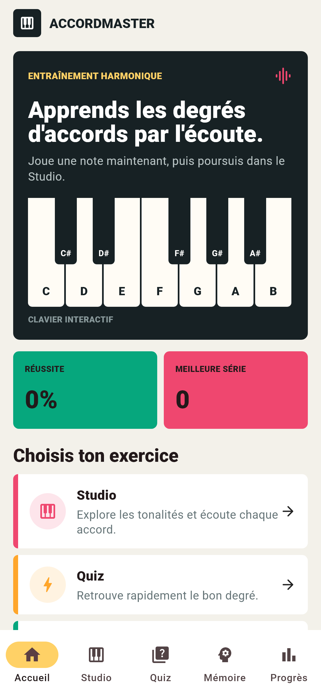
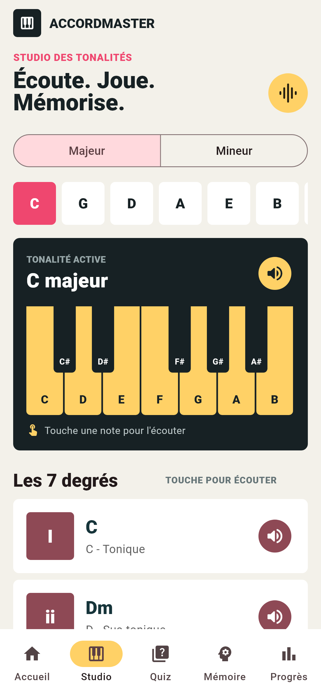
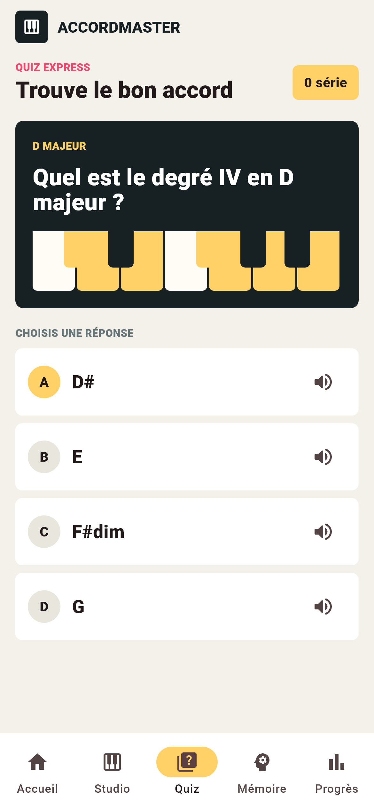
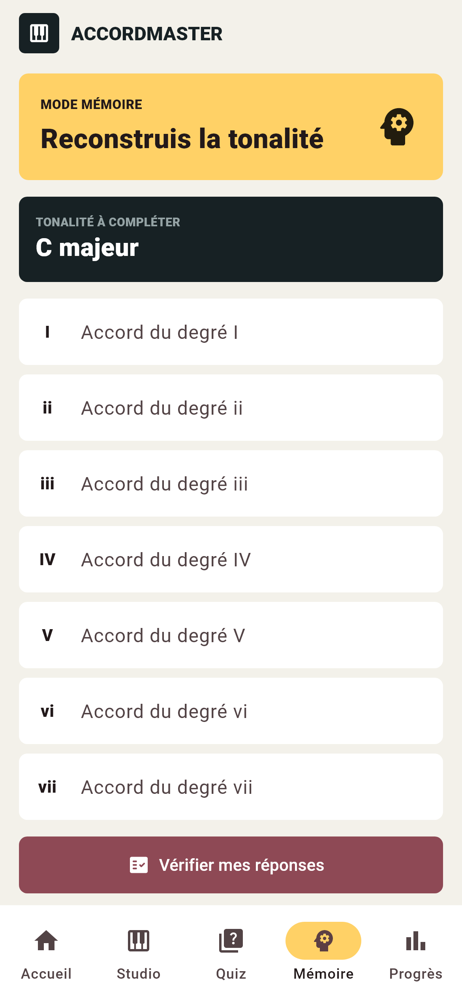
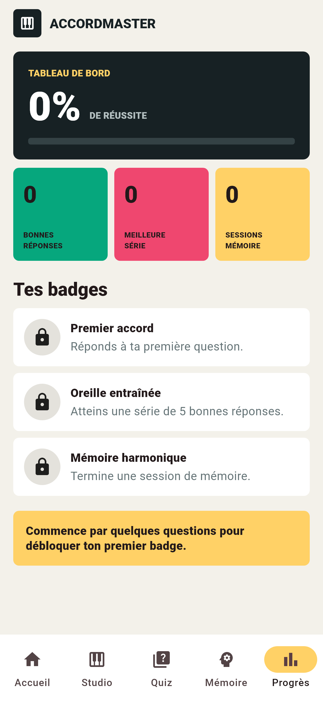

# AccordMaster

AccordMaster est un jeu mobile Flutter pour apprendre et mémoriser les degrés d'accords musicaux par l'observation, l'écoute et la répétition.

## Objectif

L'application aide les étudiants, pianistes, guitaristes et beatmakers à retrouver rapidement les sept accords d'une tonalité et à suivre leur progression.

## Fonctionnalités principales

- Studio interactif pour les tonalités majeures et mineures naturelles.
- Clavier jouable et écoute hors ligne des notes et des accords.
- Quiz aléatoire sur les tonalités majeures avec passage automatique.
- Mode mémoire pour reconstruire les sept degrés.
- Progression locale : réussite, séries, sessions et badges.

## Technologies et packages

- Flutter et Dart
- Material 3
- `shared_preferences` 2.3.3
- `audioplayers` 6.7.1
- `flutter_test`

## Prérequis

- Flutter 3.41.4 ou version compatible
- Android Studio et un émulateur, ou un téléphone Android

## Installation et lancement

```bash
flutter pub get
flutter run
```

## Tests

```bash
flutter test
flutter test integration_test
```

Les tests couvrent la théorie musicale, la génération aléatoire du quiz, la restriction aux tonalités majeures, l'affichage principal et un parcours utilisateur.

Validation finale : 6 tests unitaires/widgets et 1 parcours d'intégration réussis.

## Captures d'écran

| Accueil | Studio | Quiz |
|---|---|---|
|  |  |  |

| Mémoire | Progrès |
|---|---|
|  |  |

Les wireframes sont disponibles dans `docs/wireframes.svg`.

## Architecture

```text
lib/
  models/
  screens/
  services/
  state/
  widgets/
assets/audio/
docs/
integration_test/
test/
```

## Difficultés rencontrées

- Adaptation du package audio à la version du SDK Flutter.
- Création d'une transition automatique fiable entre les questions.
- Refonte de l'interface pour éviter un rendu générique.

## Génération de l'APK

```bash
flutter build apk --release
```

APK attendu : `build/app/outputs/flutter-apk/app-release.apk`.

La version de remise générée est disponible localement dans `output/apk/AccordMaster-v1.0.0.apk`.

## Documents

- `docs/cahier_des_charges.md`
- `docs/conception_visuelle.md`
- `docs/conception_technique.md`
- `docs/scenario_demo.md`
- `docs/rapport_tests_performance.md`

## Auteur

Projet individuel de fin d'apprentissage - Développement Mobile Flutter & Dart.
