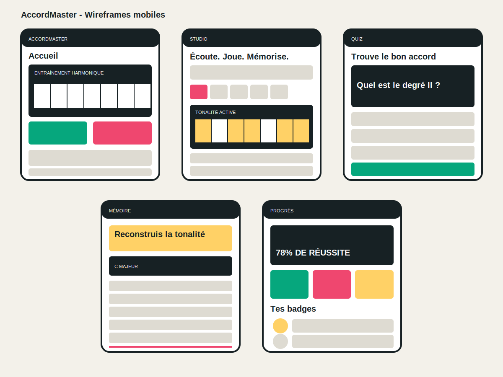

# Dossier de conception visuelle - AccordMaster

## 1. Intention UX

AccordMaster transforme la révision de l'harmonie en parcours court : écouter, observer, répondre, mémoriser puis consulter sa progression. L'interface reprend les codes d'un studio musical plutôt que ceux d'un formulaire scolaire générique.

## 2. Layout mobile

- AppBar avec le monogramme et le nom AccordMaster.
- Navigation inférieure persistante : Accueil, Studio, Quiz, Mémoire et Progrès.
- Contenu vertical défilable, adapté aux écrans mobiles.
- Clavier interactif comme élément visuel et fonctionnel central.
- États de chargement, réussite, erreur et progression automatique.

## 3. Wireframes

La planche présente les cinq écrans principaux et leurs zones d'interaction. Elle sert de référence au développement Flutter.

## 4. Écrans principaux

### Accueil

- Présentation de l'objectif pédagogique.
- Clavier jouable immédiatement.
- Résumé du taux de réussite et de la meilleure série.
- Accès rapide aux trois exercices.

### Studio

- Sélection du mode majeur ou mineur.
- Sélection horizontale de la tonalité.
- Clavier interactif avec les notes de la gamme mises en valeur.
- Sept degrés et bouton d'écoute de chaque accord.

### Quiz

- Tonalité majeure et degré choisis aléatoirement.
- Quatre réponses possibles et écoute de chaque proposition.
- Message immédiat de réussite ou d'erreur.
- Passage automatique à la question suivante après la correction.

### Mémoire

- Tonalité sélectionnée dans le Studio.
- Sept champs correspondant aux sept degrés.
- Validation globale, correction par champ et score sur sept.

### Progrès

- Taux de réussite global.
- Bonnes réponses, meilleure série et sessions mémoire.
- Badges verrouillés ou obtenus.

## 5. Flux utilisateurs

1. **Apprendre une tonalité** : Accueil -> Studio -> choisir une tonalité -> jouer les notes -> écouter les accords.
2. **Faire un quiz** : Accueil -> Quiz -> écouter ou choisir une réponse -> lire la correction -> question suivante automatique.
3. **Tester sa mémoire** : Accueil -> Mémoire -> compléter les sept accords -> vérifier -> consulter le score.

## 6. Style de base

- Fond : `#F3F1EA`.
- Surface sombre : `#172124`.
- Accent principal : rose `#EF476F`.
- Accent pédagogique : jaune `#FFD166`.
- Réussite : vert `#06A77D`.
- Typographie : Material, graisses fortes pour les titres et tailles compactes pour les données.
- Cartes : angles de 7 à 8 px, sans ombres décoratives inutiles.

## 7. Accessibilité

- Contrastes élevés entre textes et fonds.
- Zones tactiles d'au moins 44 px pour les actions principales.
- Icônes accompagnées d'un libellé ou d'une infobulle.
- Réussite et erreur indiquées par une icône, une couleur et un texte.
- Champs compatibles avec le redimensionnement du clavier mobile.
